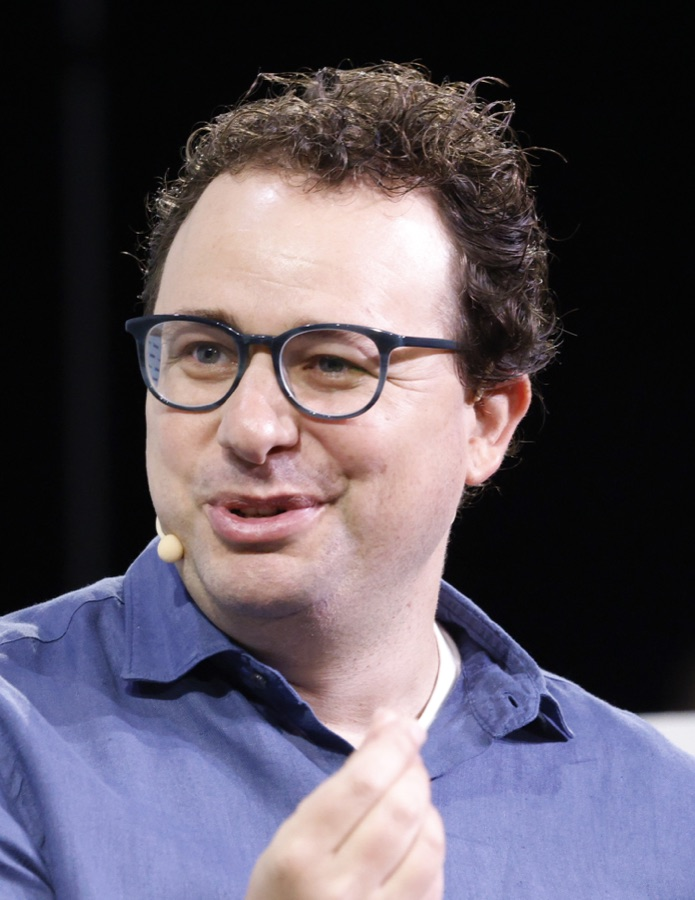

# Dario Amodei

*Dario Amodei at TechCrunch Disrupt 2023. Photograph by TechCrunch, [CC BY 2.0](https://creativecommons.org/licenses/by/2.0), via Wikimedia Commons.[^img-dario-amodei]*

## Snapshot

* Born 1983 in San Francisco. Physicist by training, moved into neural networks in the early 2010s.[^wiki-dario]
* Career runs Baidu to Google Brain to OpenAI to founding Anthropic - a four-hop path through the institutions that produced frontier AI, and one of the more useful traversal patterns this bundle is meant to expose.[^linkedin-dario]
* Co-founder and CEO of Anthropic since January 2021.[^wiki-anthropic]
* Describes himself as a co-inventor of reinforcement learning from human feedback.[^dario-site]

## Education

| Institution | Credential |
| --- | --- |
| California Institute of Technology | Attended before Stanford [^wiki-dario] |
| Stanford University | BS, physics [^wiki-dario] |
| Princeton University | MS and PhD, biophysics; Hertz Thesis Prize, 2011 [^wiki-dario] |

His academic work was in computational neuroscience and biophysics, not machine learning. The through-line that matters for the graph is that his later co-founders at Anthropic include a physicist and several scaling-oriented engineers, so the lab's founding team is not drawn from one research culture.

## Career and outcomes

The `Outcome` column is a first attempt at the founder-success signal the brief asks for: what the previous employer became, as of this batch. It is deliberately blunt and mostly says "not assessed", which is the honest state of the evidence right now.

| Organisation | Role | From | To | Outcome |
| --- | --- | --- | --- | --- |
| Baidu, Silicon Valley AI Lab | Research scientist | 2014-11 | 2015-10 | Baidu is a listed company; no outcome assessment in this batch [^linkedin-dario] |
| Google (Brain) | Senior research scientist | 2015-10 | 2016-07 | Alphabet is a listed company; no outcome assessment in this batch [^linkedin-dario] |
| OpenAI | Team lead for AI safety, then Research Director, then VP of Research | 2016-07 | 2021-01 | Active; press reports an $852B post-money valuation in March 2026 [^techcrunch-series-h] |
| Anthropic | Co-founder and CEO | 2021-01 | present | Active; $965B post-money valuation in May 2026 [^techcrunch-series-h] |

## Research contributions

The OpenAI years are where the technical identity formed, on three threads that later defined Anthropic's direction: the scaling of training compute against loss, reinforcement learning from human feedback, and mechanistic interpretability.[^wiki-anthropic] His own site states he is a co-inventor of reinforcement learning from human feedback, a self-description rather than an independent attribution.[^dario-site]

**Deliberately not asserted**, because no source consulted states it: authorship on the 2020 neural scaling laws paper, authorship on the GPT-3 paper, and the specific papers published during his Princeton period. These are the highest-value additions for iteration 2, since they are exactly what makes one lab's lineage legible against another's.

## Public positions

* Wrote "The Adolescence of Technology", an essay on AI risk, in January 2026.[^wiki-dario]
* Named to the Time 100 list in 2025.[^wiki-dario]
* Has publicly predicted significant displacement of white-collar work from AI.[^wiki-dario]
* Net worth reported at $15.5B by Forbes in June 2026, which is a press estimate of a private holding rather than a liquid number.[^wiki-dario]

## Relations

Anthropic co-founding with his sister Daniela Amodei is the family edge that explains why the two appear together in every cap-table and leadership account.[^wiki-daniela] Six other co-founders from the same OpenAI cohort are listed on the [Anthropic](/companies/anthropic.md) concept and are unwritten as individuals in this batch.

[^wiki-dario]: Wikipedia, "Dario Amodei", https://en.wikipedia.org/wiki/Dario_Amodei
[^dario-site]: Dario Amodei, personal site, https://www.darioamodei.com/
[^linkedin-dario]: Dario Amodei, professional profile, https://www.linkedin.com/in/dario-amodei-3934934/
[^wiki-anthropic]: Wikipedia, "Anthropic", https://en.wikipedia.org/wiki/Anthropic
[^wiki-daniela]: Wikipedia, "Daniela Amodei", https://en.wikipedia.org/wiki/Daniela_Amodei
[^techcrunch-series-h]: TechCrunch, "Anthropic raises $65 billion, nears $1T valuation ahead of IPO", https://techcrunch.com/2026/05/28/anthropic-raises-65-billion-nears-1t-valuation-ahead-of-ipo/
[^img-dario-amodei]: TechCrunch via Wikimedia Commons, "Dario Amodei at TechCrunch Disrupt 2023 (cropped)", CC BY 2.0, https://commons.wikimedia.org/wiki/File:Dario_Amodei_at_TechCrunch_Disrupt_2023_01_(cropped).jpg
