# Timeline of leading AI companies, people and turning points

A derived view. Nothing here is asserted for the first time: every entry repeats a dated fact that one of the concept files already carries, and cites the same source that file cites, or, in the four cases marked new, cites a first-party page read directly. The chart further down repeats the list above rather than extending it, so a reader who wants the evidence reads the list and a reader who wants the shape reads the chart.

## Text timeline

Bulleted and indented, oldest first, written to be readable on a phone with no rendering at all.

* **1960 to 1998**
  * 1960 - Yann LeCun born at Soisy-sous-Montmorency, near Paris.[^wiki-lecun]
  * 1969 - Trevor Blackwell born in Canada and raised in Saskatoon.[^wiki-blackwell]
  * 1971 - Elon Musk born.[^wiki-musk]
  * 1976 - Demis Hassabis born.[^wiki-hassabis]
  * 1983 - Durk Kingma born in the Netherlands.[^wiki-kingma]
  * 1983 - Dario Amodei born.[^wiki-dario]
  * 1985 - Sam Altman born.[^wiki-altman]
  * 1986 - Ilya Sutskever born in Nizhny Novgorod.[^wiki-sutskever]
  * 1986 - Andrej Karpathy born in Bratislava.[^wiki-karpathy]
  * 1987 - Greg Brockman born on 29 November in Thompson, North Dakota.[^wiki-brockman]
  * 1987 - Amjad Masad born.[^wiki-amjad]
  * 1988 - Wojciech Zaremba born on 30 November in Poland.[^wiki-zaremba]
  * 1988 - Mira Murati born on 16 December.[^wiki-murati]
  * 1998 - Google founded by Larry Page and Sergey Brin.[^wiki-google]
* **2010 to 2016**
  * 2010-11 - DeepMind Technologies founded in London by Demis Hassabis, Shane Legg and Mustafa Suleyman.[^wiki-deepmind]
  * 2013-12-09 - Yann LeCun becomes the first director of Meta AI Research.[^wiki-lecun]
  * 2014-01-26 - Google confirms the DeepMind acquisition.[^wiki-deepmind]
  * 2015-12 - OpenAI founded as a Delaware nonprofit with eleven named founders; Sam Altman and Elon Musk are co-chairs and the founding funders pledge $1B.[^openai-intro]
  * 2016 - Replit founded as Repl.it by Amjad Masad, Faris Masad and Haya Odeh.[^wiki-replit]
  * 2016-08 - Nvidia gifts OpenAI its first DGX-1 supercomputer.[^wiki-openai]
* **2017 to 2021**
  * 2017-06 - Andrej Karpathy becomes Tesla's director of artificial intelligence, reporting to Musk.[^wiki-karpathy]
  * 2018 - Elon Musk resigns from OpenAI's board.[^wiki-openai]
  * 2018 - Mira Murati joins OpenAI as vice president of applied AI and partnerships, two and a half years after the founding.[^wiki-murati]
  * 2021-01-26 - Anthropic founded by former OpenAI staff as a Delaware public benefit corporation.[^wiki-anthropic]
  * 2021-05 - Anthropic's first raise, $124M.[^wiki-anthropic]
  * 2021-09 - Pamela Vagata becomes a founding partner of Pebblebed, a seed-stage venture firm for technical founders.[^vcsheet] [^pebblebed]
* **2022 to 2024**
  * 2022-07 - Karpathy leaves Tesla.[^wiki-karpathy]
  * 2022-11-30 - ChatGPT released.[^wiki-openai]
  * 2023-03 - Claude launched by Anthropic.[^wiki-claude]
  * 2023-04 - Google Brain merged into Google DeepMind.[^wiki-deepmind]
  * 2023-07 - Musk launches xAI.[^wiki-musk]
  * 2023-11 - OpenAI's board removes Altman; 738 of about 770 employees sign a letter threatening to leave; he is reinstated five days later.[^wiki-openai]
  * 2024 - Sutskever leaves OpenAI.[^wiki-sutskever]
  * 2024-06 - Sutskever co-founds Safe Superintelligence Inc with Daniel Gross and Daniel Levy.[^wiki-sutskever]
  * 2024-07-16 - Karpathy announces Eureka Labs, an AI-native school.[^eureka]
  * 2024-08 - John Schulman leaves OpenAI for Anthropic.[^wiki-schulman]
  * 2024-09 - Replit releases the first version of Replit Agent.[^wiki-replit]
  * 2024-11-25 - Anthropic releases the Model Context Protocol.[^wiki-mcp]
* **2025**
  * 2025-02 - Mira Murati launches Thinking Machines Lab, and John Schulman joins as chief scientist.[^wiki-murati] [^wiki-schulman]
  * 2025-10 - Thinking Machines Lab announces Tinker, its first product.[^wiki-murati]
  * 2025-11-18 - Gemini 3 Pro released.[^wiki-gemini]
  * 2025-11-19 - LeCun confirms he is leaving Meta after ten years.[^wiki-lecun]
  * 2025-12 - The Model Context Protocol is donated to the Agentic AI Foundation under the Linux Foundation.[^wiki-mcp]
  * 2025-12 - LeCun co-founds Advanced Machine Intelligence Labs.[^wiki-lecun]
* **2026**
  * 2026-01 - LeCun becomes founding chair of the Technical Research Board of Logical Intelligence.[^wiki-lecun]
  * 2026-03 - AMI Labs raises $1.03B at a $3.5B pre-money valuation.[^wiki-lecun]
  * 2026-04 - The OpenAI Foundation commits at least $1B a year, with Wojciech Zaremba leading AI resilience.[^foundation-news]
  * 2026-05-18 - A federal jury decides for OpenAI, Altman and Brockman in Musk v. Altman, on limitation grounds; Musk announces an appeal.[^wiki-openai]
  * 2026-05-19 - Karpathy joins Anthropic to lead pretraining research.[^wiki-karpathy]
  * 2026-05-28 - Anthropic raises a $65B Series H at a $965B post-money valuation.[^techcrunch-series-h]
  * 2026-06-08 - OpenAI confirms an IPO filing with the SEC.[^wiki-openai]
  * 2026-07 - Nvidia announces a $5B investment in Safe Superintelligence Inc.[^wiki-sutskever]
  * 2026-07-15 - Thinking Machines Lab releases Inkling, its open-weights model.[^tml-news]
  * 2026-08-05 - In a message to Google DeepMind teams, Sundar Pichai announces "new roles for Demis Hassabis and Koray Kavukcuoglu".[^blog-google]
  * 2026 - Demis Hassabis becomes chair of Google DeepMind and chief scientist of Alphabet, having served as chief executive since 2010.[^wiki-hassabis]
  * 2026-09-02 - Gemini 3.8 Flash and 3.8 Flash Cyber released.[^wiki-gemini]
  * 2026-09-09 - GPT-6 Astra announced.[^openai-news]

## Timeline chart

Left to right. Six eras, four or five milestones each, short labels only: the chart is for shape, the list above is for evidence. Colons, parentheses and source markers are deliberately kept out of the labels so that the diagram renders in one pass.

```mermaid
timeline
    title Companies, people and turning points, 1960 to 2026
    section 1960 to 1998
        1960 : LeCun born near Paris
        1969 : Blackwell born in Canada
        1971 : Musk born
        1976 : Hassabis born
        1986 : Sutskever and Karpathy born
        1998 : Google founded
    section 2010 to 2016
        2010 : DeepMind founded in London
        2013 : LeCun opens Meta AI Research
        2014 : Google confirms DeepMind acquisition
        2015 : OpenAI founded by eleven named founders
        2016 : Replit founded
    section 2017 to 2021
        2018 : Musk resigns from the OpenAI board
        2018 : Murati joins OpenAI, not as a founder
        2021 : Anthropic founded
    section 2022 to 2024
        2022 : ChatGPT released
        2023 : Claude launched and xAI founded
        2024 : Sutskever leaves OpenAI and co-founds SSI
        2024 : Schulman leaves OpenAI for Anthropic
    section 2025
        2025 : Thinking Machines Lab founded
        2025 : LeCun confirms he is leaving Meta
        2025 : MCP donated to the Linux Foundation
    section 2026
        2026 : Karpathy joins Anthropic
        2026 : Nvidia puts 5B dollars into SSI
        2026 : OpenAI files for an IPO
        2026 : Hassabis steps down as DeepMind chief executive
```

## Maintenance

This file is not a second home for facts, and the rule that keeps it honest is short:

1. **Derived only.** A row is added only after the fact lands in a concept file, and it cites the same source that file cites. No row is written first and sourced later.
2. **One row per dated fact.** The related concept carries the `relations` edge; this file carries the `related-to` edges to it, so a reader can get from the chronology back to the evidence in one hop.
3. **Updated with every batch.** Whenever a batch adds a dated fact, this file and the chart are updated in the same commit, so the view never lags the corpus.
4. **Chart stays small.** The chart is capped at six eras and about four milestones each. A fact that does not change the shape goes into the list and not into the diagram.

## Coverage

Every concept in the bundle is a `related-to` target of this file. That is deliberate: a timeline that covers only some of the corpus is a claim about the corpus that would be false.

## Disputed and unverified

Two entries are weaker than the rest and are labelled as such rather than removed. The Nvidia investment in SSI is a Wikipedia figure with no first-party page retrieved, and the role-change entry of 5 August 2026 is quoted from the first-party Google post but goes no further than that post's own wording: this file does not name Hassabis's successor, because the concept file that would carry that has not been changed yet.

[^openai-intro]: OpenAI, "Introducing OpenAI", the December 2015 founding announcement, https://openai.com/index/introducing-openai/
[^wiki-openai]: Wikipedia, "OpenAI", https://en.wikipedia.org/wiki/OpenAI
[^wiki-anthropic]: Wikipedia, "Anthropic", https://en.wikipedia.org/wiki/Anthropic
[^wiki-claude]: Wikipedia, "Claude (language model)", https://en.wikipedia.org/wiki/Claude_(language_model)
[^wiki-mcp]: Wikipedia, "Model Context Protocol", https://en.wikipedia.org/wiki/Model_Context_Protocol
[^wiki-replit]: Wikipedia, "Replit", https://en.wikipedia.org/wiki/Replit
[^wiki-google]: Wikipedia, "Google", https://en.wikipedia.org/wiki/Google
[^wiki-deepmind]: Wikipedia, "Google DeepMind", https://en.wikipedia.org/wiki/Google_DeepMind
[^wiki-gemini]: Wikipedia, "Gemini (language model)", https://en.wikipedia.org/wiki/Gemini_(language_model)
[^wiki-hassabis]: Wikipedia, "Demis Hassabis", https://en.wikipedia.org/wiki/Demis_Hassabis
[^wiki-altman]: Wikipedia, "Sam Altman", https://en.wikipedia.org/wiki/Sam_Altman
[^wiki-dario]: Wikipedia, "Dario Amodei", https://en.wikipedia.org/wiki/Dario_Amodei
[^wiki-amjad]: Wikipedia, "Amjad Masad", https://en.wikipedia.org/wiki/Amjad_Masad
[^wiki-sutskever]: Wikipedia, "Ilya Sutskever", https://en.wikipedia.org/wiki/Ilya_Sutskever
[^wiki-brockman]: Wikipedia, "Greg Brockman", https://en.wikipedia.org/wiki/Greg_Brockman
[^wiki-karpathy]: Wikipedia, "Andrej Karpathy", https://en.wikipedia.org/wiki/Andrej_Karpathy
[^wiki-schulman]: Wikipedia, "John Schulman", https://en.wikipedia.org/wiki/John_Schulman
[^wiki-kingma]: Wikipedia, "Durk Kingma", https://en.wikipedia.org/wiki/Durk_Kingma
[^wiki-blackwell]: Wikipedia, "Trevor Blackwell", https://en.wikipedia.org/wiki/Trevor_Blackwell
[^wiki-zaremba]: Wikipedia, "Wojciech Zaremba", https://en.wikipedia.org/wiki/Wojciech_Zaremba
[^wiki-murati]: Wikipedia, "Mira Murati", https://en.wikipedia.org/wiki/Mira_Murati
[^wiki-lecun]: Wikipedia, "Yann LeCun", https://en.wikipedia.org/wiki/Yann_LeCun
[^wiki-musk]: Wikipedia, "Elon Musk", https://en.wikipedia.org/wiki/Elon_Musk
[^eureka]: Eureka Labs, "Introducing Eureka Labs", 16 July 2024, https://eurekalabs.ai/
[^tml-news]: Thinking Machines Lab, news index, https://thinkingmachines.ai/news
[^pebblebed]: Pebblebed, firm site, https://pebblebed.com/
[^vcsheet]: VCSheet, Pamela Vagata, secondary profile, https://www.vcsheet.com/who/pamela-vagata
[^foundation-news]: OpenAI Foundation commits $1B annually, trade report, April 2026, https://blockchain.news/news/openai-foundation-commits-1b-annually-healthcare-ai-safety
[^techcrunch-series-h]: TechCrunch, "Anthropic raises $65 billion, nears $1T valuation ahead of IPO", 28 May 2026, https://techcrunch.com/2026/05/28/anthropic-raises-65-billion-nears-1t-valuation-ahead-of-ipo/
[^openai-news]: OpenAI, news index, https://openai.com/news/
[^blog-google]: Google, "Next chapter of AI momentum", message from Sundar Pichai, 5 August 2026, https://blog.google/company-news/inside-google/message-ceo/next-chapter-ai-momentum/
