# Timeline of leading AI companies, people and turning points

A derived view. Nothing here is asserted for the first time: every entry repeats a dated fact that one of the concept files already carries, and cites the same source that file cites, or, in the four cases marked new, cites a first-party page read directly. The chart further down repeats the list above rather than extending it, so a reader who wants the evidence reads the list and a reader who wants the shape reads the chart.

## Text timeline

Bulleted and indented, oldest first, written to be readable on a phone with no rendering at all.

* **1960 to 1998**
  * 1932 - Don Valentine born in New York City; died 25 October 2019.[^wiki-dv]
  * 1951 - Ron Conway born in San Francisco and raised in an Irish Catholic family there.[^wiki-conway]
  * 1960 - Yann LeCun born at Soisy-sous-Montmorency, near Paris.[^wiki-lecun]
  * 1961 - Yuri Milner born in Moscow into a Jewish family of Soviet intellectuals.[^wiki-milner]
  * 1969 - Trevor Blackwell born in Canada and raised in Saskatoon.[^wiki-blackwell]
  * 1971 - Elon Musk born.[^wiki-musk]
  * 1972 - Sequoia Capital founded by Don Valentine in Menlo Park, California.[^wiki-sequoia] [^wiki-dv]
  * 1976 - Demis Hassabis born.[^wiki-hassabis]
  * 1977 - Nat Friedman born on 6 August.[^wiki-nat]
  * 1983 - Durk Kingma born in the Netherlands.[^wiki-kingma]
  * 1983 - Dario Amodei born.[^wiki-dario]
  * 1985 - Sam Altman born.[^wiki-altman]
  * 1985 - Milner graduates in physics at Lomonosov Moscow State University and joins the Lebedev Physical Institute, under Vitaly Ginzburg.[^wiki-milner]
  * 1986 - Ilya Sutskever born in Nizhny Novgorod.[^wiki-sutskever]
  * 1986 - Andrej Karpathy born in Bratislava.[^wiki-karpathy]
  * 1987 - Greg Brockman born on 29 November in Thompson, North Dakota.[^wiki-brockman]
  * 1987 - Amjad Masad born.[^wiki-amjad]
  * 1988 - Wojciech Zaremba born on 30 November in Poland.[^wiki-zaremba]
  * 1988 - Mira Murati born on 16 December.[^wiki-murati]
  * 1991 - Daniel Gross born in Jerusalem.[^wiki-gross]
  * 1997 - Ron Conway raises 4 million dollars for his first fund, Adam Ventures.[^wiki-conway]
  * 1998 - Google founded by Larry Page and Sergey Brin.[^wiki-google]
  * 1998-12 - Conway founds Angel Investors LP, which raises 30 million dollars for its first fund within two months and was an early investor in Google and PayPal.[^wiki-conway]
* **1999 to 2010**
  * 1999 - Nat Friedman co-founds Ximian with Miguel de Icaza.[^wiki-nat]
  * 1999 - Milner builds NetBridge with Gregory Finger and New Century Holding, after the collapse of the Soviet Union ends his computer business.[^wiki-milner]
  * 2001-02 - NetBridge merges with Port.ru, and Milner becomes chief executive of the company named Mail.Ru.[^wiki-milner]
  * 2003 - Novell acquires Ximian; Friedman stays until January 2010 as chief technology and strategy officer for open source.[^wiki-nat]
  * 2003 - David Lee joins Google as a founding member of its new business development team.[^wiki-lee]
  * 2005 - Milner founds Digital Sky Technologies, the entity distinct from the DST Global fund that follows in 2009.[^wiki-milner]
  * 2007 - David Lee joins Ron Conway's SV Angel.[^wiki-lee]
  * 2009-07-06 - Andreessen Horowitz launches with 300 million dollars of initial capitalisation, later shortened to a16z.[^wiki-a16z]
  * 2009 - DST Global is set up by Yuri Milner as a separate vehicle for the international investments of Digital Sky Technologies.[^wiki-dst]
  * 2009 - SV Angel is founded in San Francisco by Ron Conway and David Lee; its first fund raises 10 million dollars.[^wiki-sva]
* **2010 to 2016**
  * 2010 - Daniel Gross launches Greplin, a personal search engine, with Robby Walker.[^wiki-gross]
  * 2010-01 - Friedman leaves Novell after the open source strategy period ends.[^wiki-nat]
  * 2010-11 - DeepMind Technologies founded in London by Demis Hassabis, Shane Legg and Mustafa Suleyman.[^wiki-deepmind]
  * 2011-01 - DST Global and SV Angel launch the Start fund, which offers every Y Combinator startup 150,000 dollars in convertible debt.[^wiki-sva]
  * 2011-05 - Friedman and de Icaza found Xamarin, with Friedman as chief executive.[^wiki-nat]
  * 2012-03 - Milner steps down as chairperson of Mail.ru Group and leaves its board.[^wiki-milner]
  * 2012-12 - David Lee moves from Silicon Valley to Los Angeles while remaining managing partner of SV Angel.[^wiki-lee]
  * 2013-12-09 - Yann LeCun becomes the first director of Meta AI Research.[^wiki-lecun]
  * 2013 - Apple acquires Cue, the company Gross had launched as Greplin, and he stays as a director focused on machine learning.[^wiki-gross]
  * 2014-01-26 - Google confirms the DeepMind acquisition.[^wiki-deepmind]
  * 2015-05 - David Lee leaves SV Angel, in a departure the sources read describe as abrupt and acrimonious.[^wiki-lee]
  * 2015-12 - OpenAI founded as a Delaware nonprofit with eleven named founders; Sam Altman and Elon Musk are co-chairs and the founding funders pledge 1 billion dollars.[^openai-intro]
  * 2016-03 - David Lee co-founds Refactor Capital with Zal Bilimoria.[^tc-refactor]
  * 2016 - Microsoft acquires Xamarin.[^wiki-nat]
  * 2016 - Replit founded as Repl.it by Amjad Masad, Faris Masad and Haya Odeh.[^wiki-replit]
  * 2016-08 - Nvidia gifts OpenAI its first DGX-1 supercomputer.[^wiki-openai]
* **2017 to 2021**
  * 2017 - AI Grant is created by Nat Friedman and Daniel Gross; the programme says more than thirty grants have been given since then.[^aigrant]
  * 2017 - Daniel Gross joins Y Combinator as a partner focused on artificial intelligence and creates the YC AI programme.[^wiki-gross]
  * 2017-06 - Andrej Karpathy becomes Tesla's director of artificial intelligence, reporting to Musk.[^wiki-karpathy]
  * 2018-08 - Gross creates Pioneer, a remote accelerator and fund.[^wiki-gross]
  * 2018-10 - Nat Friedman becomes chief executive of GitHub.[^wiki-nat]
  * 2018 - Elon Musk resigns from OpenAI's board.[^wiki-openai]
  * 2018 - Mira Murati joins OpenAI as vice president of applied AI and partnerships, two and a half years after the founding.[^wiki-murati]
  * 2019-10-25 - Don Valentine dies.[^wiki-dv]
  * 2021-01-26 - Anthropic founded by former OpenAI staff as a Delaware public benefit corporation.[^wiki-anthropic]
  * 2021-02 - David Lee becomes head of Samsung Next.[^samsung-next]
  * 2021 - Sequoia Capital dates its partnership with OpenAI to this year, and lists Alfred Lin, James Flynn, Pat Grady and Sonya Huang on the account.[^seq-openai]
  * 2021-05 - Anthropic's first raise, 124 million dollars.[^wiki-anthropic]
  * 2021-09 - Pamela Vagata becomes a founding partner of Pebblebed, a seed-stage venture firm for technical founders.[^vcsheet] [^pebblebed]
  * 2021 - Ron Conway joins the Giving Pledge.[^wiki-conway]
* **2022 to 2024**
  * 2022-03 - SV Angel raises a 269 million dollar growth fund led by Ashvin Bachireddy.[^wiki-conway]
  * 2022-07 - Karpathy leaves Tesla.[^wiki-karpathy]
  * 2022-08 - Yuri Milner renounces his Russian citizenship, reported as a response to the invasion of Ukraine.[^wiki-milner]
  * 2022-11-30 - ChatGPT released.[^wiki-openai]
  * 2023-03 - Claude launched by Anthropic.[^wiki-claude]
  * 2023-04 - Google Brain merged into Google DeepMind.[^wiki-deepmind]
  * 2023-06-20 - ElevenLabs raises a 19 million dollar Series A co-led by Nat Friedman, Daniel Gross and Andreessen Horowitz, with SV Angel among the other participants.[^tc-eleven]
  * 2023-07 - Musk launches xAI.[^wiki-musk]
  * 2023-11 - OpenAI's board removes Altman; 738 of about 770 employees sign a letter threatening to leave; he is reinstated five days later.[^wiki-openai]
  * 2023-12-11 - Mistral AI confirms a 385 million euro Series A led by Andreessen Horowitz.[^techeu-mistral]
  * 2023 - NFDG, the partnership of Friedman and Gross, deploys the Andromeda Cluster for its portfolio companies.[^wiki-gross]
  * 2024 - Sutskever leaves OpenAI.[^wiki-sutskever]
  * 2024-05-26 - xAI raises a 6 billion dollar Series B, naming a16z and Sequoia Capital among the investors.[^xai-b]
  * 2024-06 - Sutskever co-founds Safe Superintelligence Inc with Daniel Gross and Daniel Levy.[^wiki-sutskever] [^wiki-gross]
  * 2024-07-16 - Karpathy announces Eureka Labs, an AI-native school.[^eureka]
  * 2024-08 - John Schulman leaves OpenAI for Anthropic.[^wiki-schulman]
  * 2024-08-09 - Anysphere, the company behind Cursor, raises a 60 million dollar Series A co-led by a16z and Thrive Capital.[^tc-anysphere]
  * 2024-09-04 - Safe Superintelligence discloses a reported 1 billion dollar round at a 5 billion dollar valuation, naming NFDG, a16z, Sequoia, DST Global and SV Angel.[^tc-ssi]
  * 2024-09-13 - World Labs comes out of stealth with 230 million dollars, with a16z among the investors.[^tc-worldlabs]
  * 2024-09 - Replit releases the first version of Replit Agent.[^wiki-replit]
  * 2024-11-25 - Anthropic releases the Model Context Protocol.[^wiki-mcp]
* **2025**
  * 2025-02 - Mira Murati launches Thinking Machines Lab, and John Schulman joins as chief scientist.[^wiki-murati] [^wiki-schulman]
  * 2025-03 - Safe Superintelligence reaches a 30 billion dollar valuation in a round led by Greenoaks Capital, six times the previous valuation.[^wiki-ssi]
  * 2025-07 - Daniel Gross leaves Safe Superintelligence for Meta Superintelligence Labs, and Ilya Sutskever becomes chief executive.[^wiki-ssi] [^wiki-gross]
  * 2025 - Nat Friedman joins Meta Superintelligence Labs as head of product.[^wiki-msl]
  * 2025-10 - Thinking Machines Lab announces Tinker, its first product.[^wiki-murati]
  * 2025-11-18 - Gemini 3 Pro released.[^wiki-gemini]
  * 2025-11-19 - LeCun confirms he is leaving Meta after ten years.[^wiki-lecun]
  * 2025-12 - The Model Context Protocol is donated to the Agentic AI Foundation under the Linux Foundation.[^wiki-mcp]
  * 2025-12 - LeCun co-founds Advanced Machine Intelligence Labs.[^wiki-lecun]
* **2026**
  * 2026-01 - Andreessen Horowitz raises 15 billion dollars across new funds, taking assets under management to 90 billion.[^wiki-a16z]
  * 2026-01 - LeCun becomes founding chair of the Technical Research Board of Logical Intelligence.[^wiki-lecun]
  * 2026-03 - AMI Labs raises 1.03 billion dollars at a 3.5 billion dollar pre-money valuation.[^wiki-lecun]
  * 2026-04 - The OpenAI Foundation commits at least 1 billion dollars a year, with Wojciech Zaremba leading AI resilience.[^foundation-news]
  * 2026-05-18 - A federal jury decides for OpenAI, Altman and Brockman in Musk v. Altman, on limitation grounds; Musk announces an appeal.[^wiki-openai]
  * 2026-05-19 - Karpathy joins Anthropic to lead pretraining research.[^wiki-karpathy]
  * 2026-05-28 - Anthropic raises a 65 billion dollar Series H at a 965 billion dollar post-money valuation, co-led by Sequoia Capital and with DST Global among the institutional investors.[^techcrunch-series-h]
  * 2026-06-08 - OpenAI confirms an IPO filing with the SEC.[^wiki-openai]
  * 2026-07 - Nvidia announces a 5 billion dollar investment in Safe Superintelligence Inc.[^wiki-sutskever]
  * 2026-07-15 - Thinking Machines Lab releases Inkling, its open-weights model.[^tml-news]
  * 2026-08-05 - In a message to Google DeepMind teams, Sundar Pichai announces "new roles for Demis Hassabis and Koray Kavukcuoglu".[^blog-google]
  * 2026 - Demis Hassabis becomes chair of Google DeepMind and chief scientist of Alphabet, having served as chief executive since 2010.[^wiki-hassabis]
  * 2026-09-02 - Gemini 3.8 Flash and 3.8 Flash Cyber released.[^wiki-gemini]
  * 2026-09-09 - GPT-6 Astra announced.[^openai-news]

## Timeline chart

Left to right. Six eras, four to six milestones each, short labels only: the chart is for shape, the list above is for evidence. Colons, parentheses and source markers are deliberately kept out of the labels so that the diagram renders in one pass.

```mermaid
timeline
    title Companies, people, investors and turning points, 1960 to 2026
    section 1960 to 1998
        1960 : LeCun born near Paris
        1961 : Milner born in Moscow
        1971 : Musk born
        1972 : Sequoia Capital founded by Valentine
        1991 : Gross born in Jerusalem
        1998 : Google founded
    section 1999 to 2010
        1999 : Friedman co-founds Ximian
        2001 : Milner becomes Mail.Ru chief executive
        2003 : Lee joins Google
        2009 : Andreessen Horowitz founded
        2009 : DST Global and SV Angel founded
        2010 : DeepMind founded in London
    section 2011 to 2016
        2011 : Friedman founds Xamarin
        2011 : The Start fund links DST Global and SV Angel
        2013 : Apple acquires Cue
        2014 : Google confirms the DeepMind acquisition
        2015 : Lee leaves SV Angel
        2016 : Replit founded
    section 2017 to 2021
        2017 : Friedman and Gross create AI Grant
        2018 : Musk resigns from the OpenAI board
        2019 : Valentine dies
        2021 : Anthropic founded
        2021 : Sequoia partners with OpenAI
        2021 : Lee takes over Samsung Next
    section 2022 to 2024
        2022 : ChatGPT released
        2023 : a16z leads Mistral and co-leads ElevenLabs
        2024 : Sutskever founds SSI
        2024 : Five funds back SSI
        2024 : xAI raises its Series B with a16z and Sequoia
        2024 : Schulman leaves OpenAI for Anthropic
    section 2025 to 2026
        2025 : SSI valued at 30 billion
        2025 : Friedman and Gross join Meta
        2026 : Karpathy joins Anthropic
        2026 : Nvidia puts 5B dollars into SSI
        2026 : Sequoia co-leads the Anthropic Series H
        2026 : Hassabis steps down as DeepMind chief executive
```

## Maintenance

This file is not a second home for facts, and the rule that keeps it honest is short:

1. **Derived only.** A row is added only after the fact lands in a concept file, and it cites the same source that file cites. No row is written first and sourced later.
2. **One row per dated fact.** The related concept carries the `relations` edge; this file carries the `related-to` edges to it, so a reader can get from the chronology back to the evidence in one hop.
3. **Updated with every batch.** Whenever a batch adds a dated fact, this file and the chart are updated in the same commit, so the view never lags the corpus.
4. **Chart stays small.** The chart is capped at six eras and about four milestones each. A fact that does not change the shape goes into the list and not into the diagram.

## Coverage

Every concept in the bundle that carries a dated fact is a `related-to` target of this file, which is all of them except the generated subdirectory indexes and this file itself. That is deliberate: a timeline that covers only some of the corpus is a claim about the corpus that would be false. The use-cases batch added five use-case files (no-code app building, computer use, enterprise knowledge, scientific research, customer support). The founders batch added six people files and, with them, the five fund founders' births and foundings, one death, and the career moves that connect them to the companies already here; all six are `related-to` targets above, which takes the corpus to 47 concepts.

## Disputed and unverified

Two entries are weaker than the rest and are labelled as such rather than removed. The Nvidia investment in SSI is a Wikipedia figure with no first-party page retrieved, and the role-change entry of 5 August 2026 is quoted from the first-party Google post but goes no further than that post's own wording: this file does not name Hassabis's successor, because the concept file that would carry that has not been changed yet. Two entries added with the investors batch, the March 2025 SSI valuation and the July 2025 change of chief executive at SSI, come from the encyclopaedia entry rather than from a first-party page. Three entries added with the founders batch rest on weaker evidence and are labelled rather than dropped: David Lee's move to Samsung Next, where the firm's team page confirms the role and only his own profile dates it; the AI Grant founding year, which the programme's site dates to 2017 and a reference entry to 2021; and the role-change entry of 5 August 2026, which this file still records without naming Hassabis's successor.

[^openai-intro]: OpenAI, "Introducing OpenAI", the December 2015 founding announcement, https://openai.com/index/introducing-openai/
[^wiki-openai]: Wikipedia, "OpenAI", https://en.wikipedia.org/wiki/OpenAI
[^wiki-anthropic]: Wikipedia, "Anthropic", https://en.wikipedia.org/wiki/Anthropic
[^wiki-claude]: Wikipedia, "Claude (language model)", https://en.wikipedia.org/wiki/Claude_(language_model)
[^wiki-mcp]: Wikipedia, "Model Context Protocol", https://en.wikipedia.org/wiki/Model_Context_Protocol
[^wiki-replit]: Wikipedia, "Replit", https://en.wikipedia.org/wiki/Replit
[^wiki-google]: Wikipedia, "Google", https://en.wikipedia.org/wiki/Google
[^wiki-deepmind]: Wikipedia, "Google DeepMind", https://en.wikipedia.org/wiki/Google_DeepMind
[^wiki-gemini]: Wikipedia, "Gemini (language model)", https://en.wikipedia.org/wiki/Gemini_(language_model)
[^wiki-hassabis]: Wikipedia, "Demis Hassabis", https://en.wikipedia.org/wiki/Demis_Hassabis
[^wiki-altman]: Wikipedia, "Sam Altman", https://en.wikipedia.org/wiki/Sam_Altman
[^wiki-dario]: Wikipedia, "Dario Amodei", https://en.wikipedia.org/wiki/Dario_Amodei
[^wiki-amjad]: Wikipedia, "Amjad Masad", https://en.wikipedia.org/wiki/Amjad_Masad
[^wiki-sutskever]: Wikipedia, "Ilya Sutskever", https://en.wikipedia.org/wiki/Ilya_Sutskever
[^wiki-brockman]: Wikipedia, "Greg Brockman", https://en.wikipedia.org/wiki/Greg_Brockman
[^wiki-karpathy]: Wikipedia, "Andrej Karpathy", https://en.wikipedia.org/wiki/Andrej_Karpathy
[^wiki-schulman]: Wikipedia, "John Schulman", https://en.wikipedia.org/wiki/John_Schulman
[^wiki-kingma]: Wikipedia, "Durk Kingma", https://en.wikipedia.org/wiki/Durk_Kingma
[^wiki-blackwell]: Wikipedia, "Trevor Blackwell", https://en.wikipedia.org/wiki/Trevor_Blackwell
[^wiki-zaremba]: Wikipedia, "Wojciech Zaremba", https://en.wikipedia.org/wiki/Wojciech_Zaremba
[^wiki-murati]: Wikipedia, "Mira Murati", https://en.wikipedia.org/wiki/Mira_Murati
[^wiki-lecun]: Wikipedia, "Yann LeCun", https://en.wikipedia.org/wiki/Yann_LeCun
[^wiki-musk]: Wikipedia, "Elon Musk", https://en.wikipedia.org/wiki/Elon_Musk
[^eureka]: Eureka Labs, "Introducing Eureka Labs", 16 July 2024, https://eurekalabs.ai/
[^tml-news]: Thinking Machines Lab, news index, https://thinkingmachines.ai/news
[^pebblebed]: Pebblebed, firm site, https://pebblebed.com/
[^vcsheet]: VCSheet, Pamela Vagata, secondary profile, https://www.vcsheet.com/who/pamela-vagata
[^foundation-news]: OpenAI Foundation commits $1B annually, trade report, April 2026, https://blockchain.news/news/openai-foundation-commits-1b-annually-healthcare-ai-safety
[^techcrunch-series-h]: TechCrunch, "Anthropic raises $65 billion, nears $1T valuation ahead of IPO", 28 May 2026, https://techcrunch.com/2026/05/28/anthropic-raises-65-billion-nears-1t-valuation-ahead-of-ipo/
[^openai-news]: OpenAI, news index, https://openai.com/news/
[^blog-google]: Google, "Next chapter of AI momentum", message from Sundar Pichai, 5 August 2026, https://blog.google/company-news/inside-google/message-ceo/next-chapter-ai-momentum/
[^wiki-sequoia]: Wikipedia, "Sequoia Capital", https://en.wikipedia.org/wiki/Sequoia_Capital
[^wiki-a16z]: Wikipedia, "Andreessen Horowitz", https://en.wikipedia.org/wiki/Andreessen_Horowitz
[^wiki-dst]: Wikipedia, "DST Global", https://en.wikipedia.org/wiki/DST_Global
[^wiki-sva]: Wikipedia, "SV Angel", https://en.wikipedia.org/wiki/SV_Angel
[^wiki-ssi]: Wikipedia, "Safe Superintelligence", https://en.wikipedia.org/wiki/Safe_Superintelligence
[^seq-openai]: Sequoia Capital, "OpenAI", portfolio page: founded 2015, partnered 2021, https://sequoiacap.com/companies/openai
[^tc-ssi]: TechCrunch, "Ilya Sutskever startup Safe Superintelligence raises $1B", 4 September 2024, https://techcrunch.com/2024/09/04/ilya-sutskevers-startup-safe-super-intelligence-raises-1b/
[^tc-eleven]: TechCrunch, "Voice-generating platform ElevenLabs raises $19M, launches detection tool", 20 June 2023, https://techcrunch.com/2023/06/20/voice-generating-platform-elevenlabs-raises-19m-launches-detection-tool/
[^tc-anysphere]: TechCrunch, "Anysphere, a GitHub Copilot rival, has raised $60M Series A at $400M valuation from a16z, Thrive, sources say", 9 August 2024, https://techcrunch.com/2024/08/09/anysphere-a-github-copilot-rival-has-raised-60m-series-a-at-400m-valuation-from-a16z-thrive-sources-say/
[^tc-worldlabs]: TechCrunch, "Fei-Fei Li World Labs comes out of stealth with $230M in funding", 13 September 2024, https://techcrunch.com/2024/09/13/fei-fei-lis-world-labs-comes-out-of-stealth-with-230m-in-funding/
[^techeu-mistral]: Tech.eu, "Mistral AI confirms 385 million euro Series A funding round", 11 December 2023, https://tech.eu/2023/12/11/mistral-ai-confirms-385m-series-a-funding-round
[^xai-b]: xAI, "Series B funding round", 26 May 2024, https://x.ai/news/series-b
[^wiki-nat]: Wikipedia, "Nat Friedman", https://en.wikipedia.org/wiki/Nat_Friedman
[^wiki-gross]: Wikipedia, "Daniel Gross (businessman)", https://en.wikipedia.org/wiki/Daniel_Gross_(businessman)
[^wiki-milner]: Wikipedia, "Yuri Milner", https://en.wikipedia.org/wiki/Yuri_Milner
[^wiki-dv]: Wikipedia, "Don Valentine", https://en.wikipedia.org/wiki/Don_Valentine
[^wiki-conway]: Wikipedia, "Ron Conway", https://en.wikipedia.org/wiki/Ron_Conway
[^wiki-lee]: Wikipedia, "David Lee (investor)", https://en.wikipedia.org/wiki/David_Lee_(investor)
[^wiki-msl]: Wikipedia, "Meta Superintelligence Labs", https://en.wikipedia.org/wiki/Meta_Superintelligence_Labs
[^aigrant]: AI Grant, programme site, observed 11 September 2026, https://new.aigrant.org/
[^samsung-next]: Samsung Next, team page, observed 11 September 2026, https://www.samsungnext.com/team
[^tc-refactor]: TechCrunch, "David Lee is back with a new fund: Refactor Capital", 22 March 2016, https://techcrunch.com/2016/03/22/david-lee-is-back-with-a-new-fund-refactor-capital/
